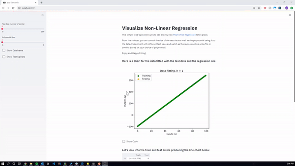
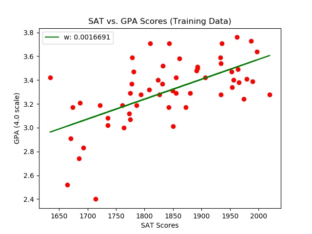
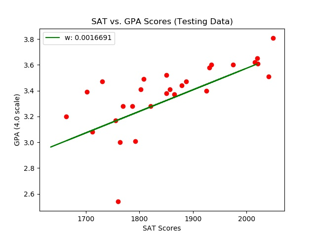

# Regression Sandbox
An educational web-app built from streamlit to interact and visualize polynomial regression models

<!---->

_Web app code contained in app.py_

## Features to be added
- [ ] Show code that is executing
- [ ] Show other datasets
- [ ] Structure the application in a more readable manner
- [ ] Add error function equations, and weight calculations
- [ ] Graph with lines not points
- [ ] Animate the visualization of Voronoi Tesselation for 1-NN
- [ ] Provide a section on the math behind it

## About
This web-app was created using [streamlit](https://streamlit.io), [matplotlib](https://matplotlib.org),[sci-kit learn](https://scikit-learn.org/stable/), [pandas](https://pandas.pydata.org/) and [NumPy](https://numpy.org). It is currently a WIP with plans to add more features soon!

<!---A practice in utilizing linear regression to predict a candidates GPA based on SAT scores

Dataset was taken from [here](https://www.kaggle.com/luddarell/101-simple-linear-regressioncsv)

_Training vs. Testing data based on the same regression line (green)_

## Background
This dataset is based on the 2400 SAT score which was [changed in 2005](https://www.nytimes.com/2002/06/23/us/new-sat-writing-test-is-planned.html) to include a new writing section graded out of 800 points (hence the 800 point increase from the previous 1600 points), and then [changed once again in March of 2014](https://apps.washingtonpost.com/g/page/local/key-shifts-of-the-sat-redesign/858/), with one of the changes being a return to the 1600-point system that was previously used. The first updated exam was administered in March of 2016.

--->
