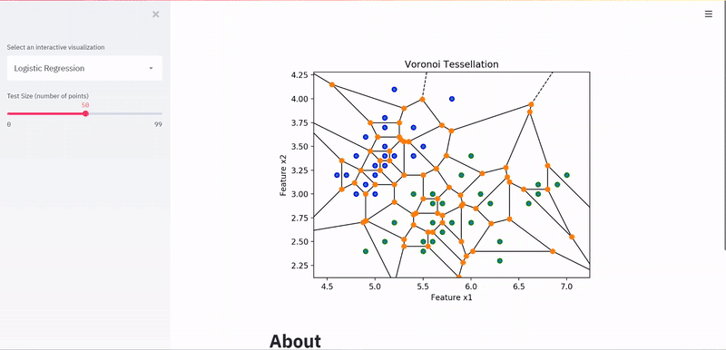

# A web-app built with [streamlit](https://streamlit.io) to visualize and interact with machine learning models

[](https://travis-ci.com/eric-li18/modelweave)


CI/CD pipeline setup with Travis-CI. Running on a Docker container hosted on [ Heroku](https://modelweave.herokuapp.com/).


_Polynomial Regression_




_Voronoi Tessellation_

## Running the Code
The above code can be run via the Dockerfile in the project's root directory with:
```
docker build -t modelweave ./
docker run -p 8080:8080 -itd --name modelweave modelweave
```
Alternatively, the code can be run via:
```
pip install streamlit
streamlit run app.py
```

## Code Contribution
Basic ML code was provided by [Madhu G Nadig's repository](https://github.com/madhug-nadig/Machine-Learning-Algorithms-from-Scratch)

## Progress
- [ ] Structure the application in a more readable manner
- [ ] Add error function equations, and weight calculations
- [ ] Graph with lines not points
- [ ] Animate the visualization of Voronoi Tesselation for 1-NN
- [x] Add CI/CD and deploy onto cloud provider
- [x] Plot in plotly for interactivity

## About
Front-end was done using [streamlit](https://streamlit.io) and various other ML and plot libraries. It is currently a WIP with plans to add more features soon!

<!---A practice in utilizing linear regression to predict a candidates GPA based on SAT scores

Dataset was taken from [here](https://www.kaggle.com/luddarell/101-simple-linear-regressioncsv)


_Training vs. Testing data based on the same regression line (green)_

## Background
This dataset is based on the 2400 SAT score which was [changed in 2005](https://www.nytimes.com/2002/06/23/us/new-sat-writing-test-is-planned.html) to include a new writing section graded out of 800 points (hence the 800 point increase from the previous 1600 points), and then [changed once again in March of 2014](https://apps.washingtonpost.com/g/page/local/key-shifts-of-the-sat-redesign/858/), with one of the changes being a return to the 1600-point system that was previously used. The first updated exam was administered in March of 2016.

--->
